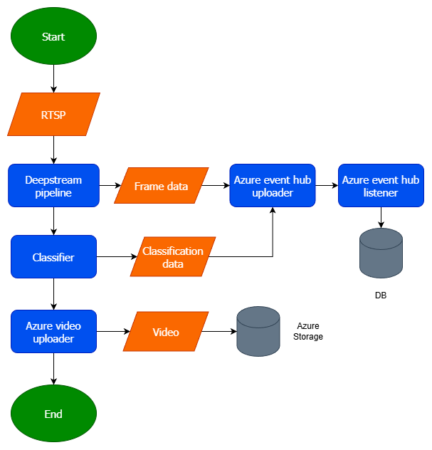

# DeepStream YOLO Pose Pipeline

This fork packages the DeepStream YOLO pose pipeline into a maintainable Python application focused on multi-camera ingestion, pose-aware analytics, and downstream publishing. The document walks through the runtime flow and explains the role of every project file so you can extend the system with confidence.

-----------------------------------------------------------------------------------------------------------------
## End-to-End Flow

1. **Entry point spins up the environment**  
   [main.py](DeepStream-Yolo-Pose/main.py) imports configuration, initializes GStreamer, and builds the shared output/worker infrastructure.
2. **Configuration and runtime state are resolved**  
   [src/config.py](DeepStream-Yolo-Pose/src/config.py) reads `DeepStream-Yolo-Pose/config/deepstream.yaml`, validates required fields, and creates a `RuntimeConfig` that tracks toggles such as CSV and database output.
3. **Outputs and background workers start**  
   [src/outputs.py](DeepStream-Yolo-Pose/src/outputs.py) prepares the CSV writer and the Event Hub helper. [src/workers.py](DeepStream-Yolo-Pose/src/workers.py) launches the queue-driven database worker plus per-camera uploader threads.
4. **Pipelines are created per camera**  
   For every `(source, camera_id)` pair the entry point instantiates [src/pipeline.py](DeepStream-Yolo-Pose/src/pipeline.py) which wires the GStreamer graph, attaches DeepStream probes, and hands the DB queue to enqueue events.
5. **Frame processing and analytics**  
   Buffer probes parse detections, call [src/vision.py](DeepStream-Yolo-Pose/src/vision.py) to extract keypoints, update FPS and recording windows via [src/analytics.py](DeepStream-Yolo-Pose/src/analytics.py), and stream detections to CSV and the DB queue.
6. **Workers publish to external systems**  
   The DB worker drains queued frames through [src/send_helper.py](DeepStream-Yolo-Pose/src/send_helper.py) to Azure Event Hub. Uploader threads from [src/uploader.py](DeepStream-Yolo-Pose/src/uploader.py) sync recorded clips per camera when enabled.
7. **Graceful shutdown**  
   When the GLib loop exits the entry point tears down pipelines, flushes queues, closes writers, and prints a summary of enabled outputs.

-----------------------------------------------------------------------------------------------------------------
## Runtime Sequence

- **Initialization**
  - Load YAML config and compute runtime booleans (CSV/DB flags, dimensions, GPU id).
  - Instantiate `OutputManager`, start CSV/Event Hub integrations, and spin up the DB queue + worker.
  - Launch uploader threads for auxiliary clip syncing.
  - Create one `CameraPipeline` per camera, each with its own GStreamer bin, inference elements, and analytics helpers.
- **Main loop**
  - Start all pipelines and the GLib `MainLoop` to process GStreamer bus events.
  - Each buffer probe extracts metadata, keypoints, timestamps, and detection scores; detections are logged to CSV and enqueued for the DB worker.
  - Recording manager opens/closes clips based on detections, while FPS tracker prints rolling stats to the log.
- **Shutdown**
  - On termination, stop pipelines, join uploader threads, wait for the DB queue to drain, flush pending Event Hub batches, close the CSV file, and print an execution summary.

-----------------------------------------------------------------------------------------------------------------
## Video File Lifecycle

For each camera clip, filenames evolve through these states:

0. **Per-camera storage and metadata sidecar**
   - Each clip is written under `output/<camera_id>/`.
   - Alongside the MP4, the pipeline writes a JSON sidecar (`<timestamp>.json`) with tracked detections used by the classifier.

1. **Writing in progress**
   - While the recorder is actively writing, the file is named `temp_<timestamp>.mp4`.
2. **Clip finalized**
   - When recording for that clip closes, it is renamed to `<timestamp>.mp4`.
3. **Classifier completed**
   - After the classifier finishes processing the clip and metadata pair, it is renamed to `ready_<timestamp>.mp4`.
4. **Upload and cleanup**
   - The uploader sends `ready_<timestamp>.mp4` to Azure storage and then removes the local file after successful upload.
   

-----------------------------------------------------------------------------------------------------------------
## Why One Pipeline per Camera

This project intentionally creates one pipeline per camera instead of a single DeepStream multi-source pipeline.

- **Independent video outputs per camera**
   - Each camera has its own encoder and clip lifecycle, making per-camera MP4 generation and rotation straightforward.
- **Failure and latency isolation**
   - A slow, unstable, or disconnected RTSP source does not directly stall the rest of the cameras.
- **Per-camera tuning flexibility**
   - Resolution, bitrate, reconnection behavior, and recording thresholds can be adjusted per source without complex branching.
- **Cleaner analytics alignment**
   - Detection metadata, clip boundaries, and downstream classification stay scoped to a single camera timeline.

### Trade-offs vs a single DeepStream multi-camera graph

- A single batched graph can improve raw inference efficiency in some workloads.
- However, it increases coupling between sources and can make per-camera recording control, debugging, and recovery more complex.
- For this application (camera-specific clips and downstream per-camera processing), isolation and operational simplicity are prioritized.

-----------------------------------------------------------------------------------------------------------------
## File Reference

- [main.py](DeepStream-Yolo-Pose/main.py) – Primary entry point; orchestrates configuration loading, worker startup, pipeline initialization, GLib loop execution, and final teardown.
- [src/config.py](DeepStream-Yolo-Pose/src/config.py) – Parses `DeepStream-Yolo-Pose/config/deepstream.yaml`, validates required fields, exposes data classes for arguments/constants, and provides helpers like `current_timestamp`.
- [src/pipeline.py](DeepStream-Yolo-Pose/src/pipeline.py) – Defines `CameraPipeline`, constructs the GStreamer graph, installs DeepStream probes, formats detections, manages recording, and pushes events into the DB queue.
- [src/analytics.py](DeepStream-Yolo-Pose/src/analytics.py) – Houses `FPSTracker` for per-stream performance and `RecordingManager` for clip lifecycle based on detection activity.
- [src/vision.py](DeepStream-Yolo-Pose/src/vision.py) – Pose utilities: skeleton definition, keypoint extraction from DeepStream metadata, bounding-box helpers, and pose-detection matching logic.
- [src/outputs.py](DeepStream-Yolo-Pose/src/outputs.py) – `OutputManager` handles CSV headers/rows, Event Hub setup, detection formatting, and cleanup plus convenience summary lines.
- [src/workers.py](DeepStream-Yolo-Pose/src/workers.py) – Creates the bounded DB queue, runs the background consumer that hands events to `OutputManager`, and spawns uploader threads per camera.
- [src/send_helper.py](DeepStream-Yolo-Pose/src/send_helper.py) – Thin wrapper around the Azure Event Hub SDK; batches detection payloads, tracks stats, and exposes `flush`/`close` operations.
- [src/uploader.py](DeepStream-Yolo-Pose/src/uploader.py) – Interacts with storage services to synchronize recorded clips generated by `RecordingManager`.
- [config/deepstream.yaml](DeepStream-Yolo-Pose/config/deepstream.yaml) – Central configuration file containing sources, camera identifiers, inference configs, output destinations, and runtime tuning constants.

### Classifier Submodule Integration

- The age-group classifier is consumed from an external repository as a submodule/vendorized package under [src/age_group_classifier](DeepStream-Yolo-Pose/src/age_group_classifier).
- The runtime integration entrypoint is [src/age_group_classifier/src/inference/api.py](DeepStream-Yolo-Pose/src/age_group_classifier/src/inference/api.py), which exposes `AgeGroupClassifier`.
- The background worker loads and calls this API from [src/classifier_worker.py](DeepStream-Yolo-Pose/src/classifier_worker.py) to classify crops extracted from recorded clips.

-----------------------------------------------------------------------------------------------------------------
## Running the Application

1. Install NVIDIA DeepStream, the Python bindings (`pyds`), and compile the YOLO pose custom library as described in the original project documentation.  
   Reference: https://github.com/marcoslucianops/DeepStream-Yolo
2. Adjust `DeepStream-Yolo-Pose/config/deepstream.yaml` with your camera URIs, camera IDs, output directories, and inference configs.
3. Launch the pipeline:

   ```bash
   python3 DeepStream-Yolo-Pose/main.py
   ```

-----------------------------------------------------------------------------------------------------------------
## Extending the Pipeline

- To adjust inference behavior, edit the `arguments` and `constants` sections in `DeepStream-Yolo-Pose/config/deepstream.yaml`; the settings surface automatically in `RuntimeConfig`.
- To add new analytics, extend `CameraPipeline._osd_buffer_probe` in [src/pipeline.py](DeepStream-Yolo-Pose/src/pipeline.py) and place reusable utilities in [src/analytics.py](DeepStream-Yolo-Pose/src/analytics.py) or [src/vision.py](DeepStream-Yolo-Pose/src/vision.py).
- To publish to other sinks, implement additional methods in [src/outputs.py](DeepStream-Yolo-Pose/src/outputs.py) or start new worker threads in [src/workers.py](DeepStream-Yolo-Pose/src/workers.py).

-----------------------------------------------------------------------------------------------------------------
## Additional Resources

- Original DeepStream-YOLO repository: https://github.com/marcoslucianops/DeepStream-Yolo
- Original DeepStream-YOLO-Pose repository: https://github.com/marcoslucianops/DeepStream-Yolo-Pose
- NVIDIA DeepStream Python Apps: https://github.com/NVIDIA-AI-IOT/deepstream_python_apps

These references cover model export, TensorRT engine generation, and platform-specific build steps that continue to apply to this fork.
